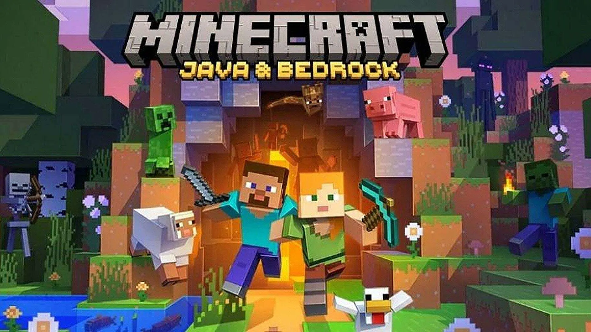

# 🛠️ Host Your Own Minecraft Server on AWS EC2 (Linux)

A step-by-step guide to setting up a **personal Minecraft server** on an **Amazon EC2 instance** using the command line.



---

## 📋 Table of Contents
- [🚀 Introduction](#-introduction)
- [✅ Prerequisites](#-prerequisites)
- [⚙️ Step 1: AWS EC2 Setup](#️-step-1-aws-ec2-setup)
- [💻 Step 2: Connecting to Your Instance](#-step-2-connecting-to-your-instance)
- [📦 Step 3: Installing Server Software](#-step-3-installing-server-software)
- [▶️ Step 4: Running Your Minecraft Server](#️-step-4-running-your-minecraft-server)
- [🎮 Step 5: Connecting to Your Server](#-step-5-connecting-to-your-server)
- [💸 Cost Management & Tips](#-cost-management--tips)
- [🛠️ Troubleshooting](#️-troubleshooting)

---

## 🚀 Introduction

Why pay for a managed Minecraft host when you can build your own?

This guide walks you through the process of creating a Minecraft server using:
- **Cloud Computing**: Provisioning and managing an EC2 instance
- **Networking**: Configuring security groups and ports
- **Linux Administration**: Using SSH, installing software, and managing processes with `screen`

---

## ✅ Prerequisites

- ✅ AWS Account
- ✅ Minecraft: Java Edition (Bedrock Edition Tutorial Coming Soon!)

---

## ⚙️ Step 1: AWS EC2 Setup

### Launch an EC2 Instance:

1. Log in to the **AWS Console** and navigate to **EC2 Dashboard**
2. Click **"Launch Instance"**
3. **Name**: `Minecraft-Server`
4. **AMI**: Select **Ubuntu Server (Latest LTS)**
5. **Instance Type**: Use `t2.medium` or `t3.medium`  
   *(Note: `t2.micro` is NOT sufficient for Minecraft)*
6. **Key Pair**: Create and download the `.pem` file
7. **Security Group Settings**:
   - SSH:  
     - Type: SSH  
     - Port: 22  
     - Source: My IP
   - Minecraft:
     - Type: Custom TCP  
     - Port: 25565  
     - Source: Anywhere `0.0.0.0/0`

Click **Launch Instance**!

---

## 💻 Step 2: Connecting to Your Instance

1. Open Terminal
2. Run:
   ```bash
   chmod 400 your-key-name.pem
   ssh -i "your-key-name.pem" ubuntu@YOUR_PUBLIC_IP


---

## 📦 Step 3: Installing Server Software

### Update System:

```bash
sudo apt update && sudo apt upgrade -y
```

### Install Java (Java 17):

```bash
sudo apt install openjdk-17-jre-headless -y
java -version
```

### Create Minecraft Directory:

```bash
mkdir minecraft-server
cd minecraft-server
```

### Download Minecraft Server:

Go to the [official server download page](https://www.minecraft.net/en-us/download/server), copy the `.jar` link, and run:

```bash
wget PASTE_THE_DOWNLOAD_LINK_HERE
```

---

## ▶️ Step 4: Running Your Minecraft Server

### First Run (will fail to accept EULA):

```bash
java -Xmx1024M -Xms1024M -jar server.jar nogui
```

### Accept EULA:

```bash
nano eula.txt
# Change to: eula=true
# Save and exit (Ctrl+X, Y, Enter)
```

### Run with `screen` for persistence:

```bash
sudo apt install screen -y
screen -S minecraft
java -Xmx1024M -Xms1024M -jar server.jar nogui
```

To detach: `Ctrl + A`, then `D`
To reattach later:

```bash
screen -r minecraft
```

---

## 🎮 Step 5: Connecting to Your Server

1. Launch Minecraft Java Edition
2. Click **Multiplayer** > **Add Server**
3. Use your EC2 public IP as the server address
4. Join and play!

---

## 💸 Cost Management & Tips

* Stop your EC2 instance when not in use to save costs.
* Use `t3.medium` for balanced performance and pricing.
* Set up **CloudWatch Alarms** to monitor usage.
* Consider EBS snapshot backups for world saves.

---

## 🛠️ Troubleshooting

| Problem               | Fix                                                          |
| --------------------- | ------------------------------------------------------------ |
| Can't connect via SSH | Check `.pem` permissions and correct IP address              |
| Port 25565 blocked    | Verify Security Group rules                                  |
| Server lagging        | Upgrade to a higher instance or optimize server config       |
| Java error            | Ensure you installed the correct version (Java 17 for 1.17+) |

---

## 🌐 Author

Made with ❤️ by \[YourNameHere]
Feel free to fork or contribute!

---

## 📸 Showcase

> *(Add your screenshots or in-game builds here!)*


---

## 🧠 Learn More

* [AWS EC2 Documentation](https://docs.aws.amazon.com/ec2/)
* [Minecraft Server Setup](https://minecraft.net/download/server)
* [Ubuntu Commands Cheat Sheet](https://ubuntu.com/tutorials/command-line-for-beginners)

```
